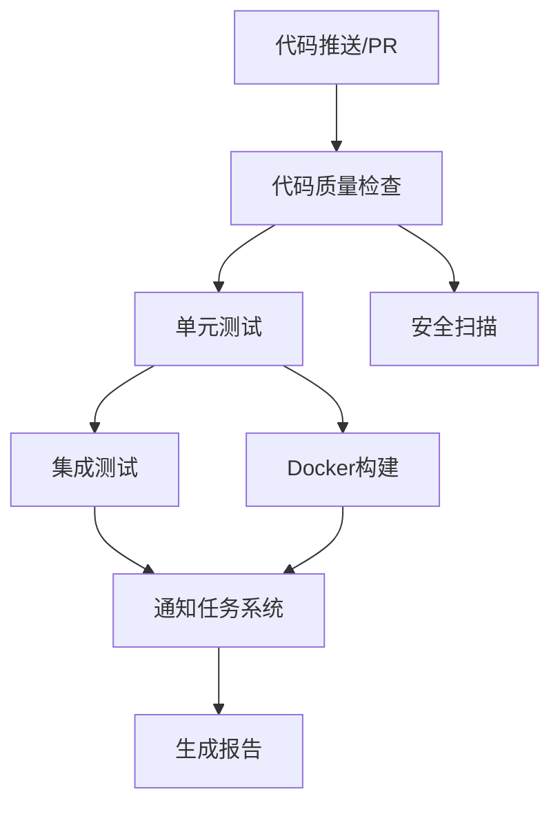
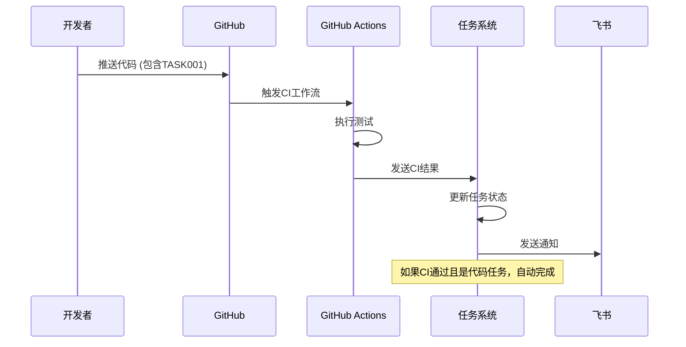

# 🚀 GitHub Actions CI/CD 配置指南

本文档详细说明如何配置GitHub Actions与任务管理系统集成，实现自动化测试和验收流程。

## 📋 目录

- [概述](#概述)
- [前置要求](#前置要求)
- [配置步骤](#配置步骤)
- [工作流详解](#工作流详解)
- [任务集成](#任务集成)
- [测试说明](#测试说明)
- [故障排除](#故障排除)

## 🎯 概述

GitHub Actions配置实现了以下功能：

- **自动化测试**：代码质量检查、单元测试、集成测试
- **构建验证**：Docker镜像构建和运行测试
- **安全扫描**：依赖安全性和代码安全检查
- **任务集成**：自动通知任务系统CI结果
- **智能验收**：基于CI结果自动完成代码任务

## ✅ 前置要求

### 1. 系统要求
- Python 3.9+
- Docker (用于构建测试)
- 有效的GitHub仓库
- 任务管理系统部署并可公网访问

### 2. 权限要求
- GitHub仓库的管理员权限
- 配置Secrets的权限
- 设置Webhooks的权限

## 🔧 配置步骤

### 步骤1: 复制工作流文件

确保项目根目录存在以下文件：
```
.github/
└── workflows/
    └── ci.yml          # 主CI工作流
```

### 步骤2: 配置GitHub Secrets

在GitHub仓库设置中添加以下Secrets：

```bash
# 必需的Secrets
TASK_WEBHOOK_URL=https://your-domain.com/webhook/github/
GITHUB_WEBHOOK_SECRET=your-webhook-secret-key

# 可选的Secrets (用于特定功能)
FEISHU_APP_ID=cli_xxxxxxxxxxxxxxxx
FEISHU_APP_SECRET=your_feishu_app_secret
DEEPSEEK_KEY=sk-xxxxxxxxxxxxxxxx
```

#### 配置方法：
1. 进入GitHub仓库 → Settings → Secrets and variables → Actions
2. 点击 "New repository secret"
3. 添加上述每个Secret

### 步骤3: 配置Webhook

1. **在任务系统中获取Webhook URL**：
   ```
   https://your-task-system.com/webhook/github/
   ```

2. **在GitHub仓库中设置Webhook**：
   - 进入 Settings → Webhooks → Add webhook
   - Payload URL: `https://your-task-system.com/webhook/github/`
   - Content type: `application/json`
   - Secret: 与`GITHUB_WEBHOOK_SECRET`相同
   - 选择事件：
     - [x] Workflow runs
     - [x] Check runs
     - [x] Pushes
     - [x] Pull requests

### 步骤4: 项目配置

确保项目包含必要的配置文件：

1. **Makefile** (已创建)
2. **tests/** 目录结构 (已创建)
3. **config.yaml.example** (已创建)

## 📖 工作流详解

### CI Pipeline 结构



### 作业说明

| 作业名称 | 功能描述 | 执行条件 |
|---------|---------|---------|
| `quality-check` | 代码格式、规范、类型检查 | 所有事件 |
| `unit-tests` | 单元测试和覆盖率 | 质量检查通过后 |
| `integration-tests` | 集成测试 | 单元测试通过后 |
| `security-scan` | 安全扫描 | 仅PR事件 |
| `docker-build` | Docker构建测试 | 质量检查和单元测试通过后 |
| `notify-task-system` | 通知任务系统 | 主要作业完成后 |
| `generate-report` | 生成测试报告 | 总是执行 |

## 🔗 任务集成

### 任务ID识别

系统通过以下方式识别关联的任务：

1. **Commit消息**：包含 `TASK123` 格式的任务ID
2. **PR标题**：包含 `TASK123` 格式的任务ID
3. **Webhook元数据**：CI工作流主动传递任务信息

#### 示例Commit消息：
```bash
git commit -m "TASK001: 实现用户登录API功能

- 添加JWT token生成
- 实现密码验证逻辑
- 添加用户状态检查"
```

#### 示例PR标题：
```
TASK001: 用户登录功能开发
```

### 自动验收流程



## 🧪 测试说明

### 本地测试

```bash
# 安装依赖
make install-dev

# 运行所有测试
make test

# 运行特定类型测试
make test-unit
make test-integration

# 生成覆盖率报告
make test-coverage

# 代码质量检查
make lint
make format-check
make type-check

# 安全扫描
make security
```

### 手动触发CI

在GitHub界面中：
1. 进入 Actions 标签页
2. 选择 "CI Pipeline" 工作流
3. 点击 "Run workflow"
4. 选择分支并运行

### 测试环境变量

CI运行时会设置测试环境变量：
```yaml
env:
  FEISHU_APP_ID: test_app_id
  FEISHU_APP_SECRET: test_app_secret
  DEEPSEEK_KEY: test_deepseek_key
```

## 🔍 监控和调试

### 查看CI状态

1. **GitHub界面**：
   - 仓库首页的绿色✅或红色❌图标
   - Actions 标签页查看详细日志

2. **任务系统日志**：
   ```bash
   # 查看应用日志
   tail -f app.log | grep -i "github\|webhook"
   ```

3. **飞书通知**：
   - CI开始运行通知
   - CI完成结果通知（成功/失败）

### 常见CI状态

| 状态 | 含义 | 任务系统行为 |
|-----|------|------------|
| ✅ success | 所有检查通过 | 自动完成代码任务 |
| ❌ failure | 至少一项检查失败 | 通知修复，任务保持进行中 |
| 🟡 cancelled | CI被取消 | 通知取消，任务状态不变 |
| ⏱️ timed_out | CI超时 | 通知超时，任务状态不变 |

## 🛠️ 故障排除

### 常见问题

#### 1. CI没有触发
**可能原因**：
- Webhook配置错误
- 分支名不匹配
- 工作流文件语法错误

**解决方法**：
```bash
# 检查工作流语法
yamllint .github/workflows/ci.yml

# 检查分支配置
git branch -r
```

#### 2. 任务系统没收到通知
**可能原因**：
- TASK_WEBHOOK_URL配置错误
- 网络连接问题
- 签名验证失败

**解决方法**：
```bash
# 测试webhook连接
curl -X POST $TASK_WEBHOOK_URL \
  -H "Content-Type: application/json" \
  -H "X-GitHub-Event: ping" \
  -d '{"test": true}'

# 检查任务系统日志
grep -i "github\|webhook" app.log
```

#### 3. 测试失败
**可能原因**：
- 测试环境配置问题
- 依赖版本冲突
- 代码质量问题

**解决方法**：
```bash
# 本地运行测试
make test

# 检查依赖
pip check

# 修复代码格式
make format
```

#### 4. Docker构建失败
**可能原因**：
- Dockerfile配置错误
- 依赖安装失败
- 资源不足

**解决方法**：
```bash
# 本地测试Docker构建
make docker-build

# 检查Dockerfile
docker build -t test .
```

### 调试技巧

1. **启用详细日志**：
   ```yaml
   # 在CI工作流中添加
   env:
     ACTIONS_RUNNER_DEBUG: true
     ACTIONS_STEP_DEBUG: true
   ```

2. **使用tmate调试**：
   ```yaml
   - name: Debug with tmate
     uses: mxschmitt/action-tmate@v3
     if: failure()
   ```

3. **本地模拟CI环境**：
   ```bash
   # 使用act工具本地运行GitHub Actions
   act -j quality-check
   ```

## 📚 扩展配置

### 添加新的检查项

在 `.github/workflows/ci.yml` 中添加新的作业：

```yaml
custom-check:
  name: Custom Check
  runs-on: ubuntu-latest
  steps:
    - uses: actions/checkout@v4
    - name: 运行自定义检查
      run: |
        # 你的自定义检查逻辑
        echo "Running custom checks..."
```

### 配置不同环境

为不同分支配置不同的CI行为：

```yaml
on:
  push:
    branches: [ main, develop, staging ]
  pull_request:
    branches: [ main ]

jobs:
  test:
    strategy:
      matrix:
        environment: 
          - ${{ github.ref == 'refs/heads/main' && 'production' || 'development' }}
```

### 集成其他服务

```yaml
  deploy:
    if: github.ref == 'refs/heads/main' && github.event_name == 'push'
    needs: [quality-check, unit-tests, docker-build]
    runs-on: ubuntu-latest
    steps:
      - name: 部署到生产环境
        run: |
          # 部署脚本
          echo "Deploying to production..."
```

## 🎉 总结

通过本配置，您的项目将拥有：

- ✅ 全自动的代码质量检查
- ✅ 完整的测试覆盖率报告
- ✅ 安全扫描和漏洞检测
- ✅ 与任务系统的无缝集成
- ✅ 智能的任务自动验收
- ✅ 实时的进度通知

享受自动化带来的效率提升！🚀

---

**相关文档**：
- [任务管理系统部署指南](README_DEPLOYMENT.md)
- [开发环境配置](doc/task_bot_mvp_运行与环境配置.md)
- [API文档](http://localhost:8000/docs) 