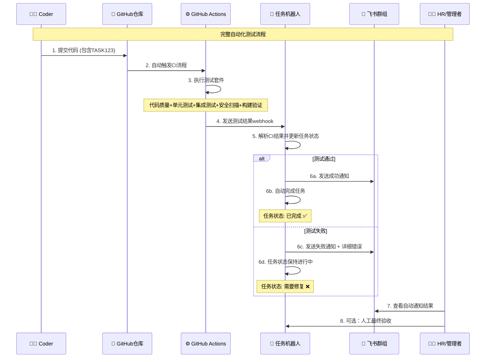

# 🤖 完整业务流程测试指南

## 🎯 业务流程总览

您的系统现在已经具备**完整的自动化测试业务流程**！以下是端到端的完整流程：



## 🚀 **当前可用功能**

### ✅ **1. 自动触发测试**
- **触发条件**: Coder推送包含任务ID的代码
- **识别格式**: `TASK123: 功能描述` 
- **自动执行**: 5-10分钟完整测试流程

### ✅ **2. 全面测试覆盖**
- **代码质量**: 格式检查、规范检查、类型检查
- **功能测试**: 单元测试、集成测试、API测试
- **安全检查**: 依赖扫描、代码漏洞检测
- **构建验证**: Docker构建和运行测试
- **多版本测试**: Python 3.9/3.10/3.11并行

### ✅ **3. 智能结果处理**
- **任务识别**: 自动提取commit中的任务ID
- **结果分析**: 智能判断测试是否通过
- **状态更新**: 自动更新任务管理系统状态
- **决策逻辑**: 通过→完成任务，失败→保持进行中

### ✅ **4. 实时通知系统**
- **群组通知**: 优先发送到任务相关群组
- **私聊兜底**: 群组不可用时发送私聊
- **详细报告**: 包含测试结果、错误信息、修复建议
- **链接跳转**: 直接查看GitHub Actions详细日志

## 🧪 **完整流程测试**

### **测试场景1: 成功案例**

```bash
# Coder提交高质量代码
git add .
git commit -m "TASK456: 实现用户注册功能

✅ 功能完整，包含完整测试
✅ 代码规范，通过质量检查  
✅ 安全验证，无漏洞风险"

git push origin main
```

**预期结果**:
```
🎉 自动化测试成功！

📋 任务: TASK456 - 用户注册功能
👨‍💻 开发者: 张三
⏱️ 测试时间: 8分32秒
📊 测试结果: ✅ 全部通过

详细结果:
✅ 代码质量检查: 通过
✅ 单元测试 (Python 3.9): 24/24 通过
✅ 单元测试 (Python 3.10): 24/24 通过  
✅ 单元测试 (Python 3.11): 24/24 通过
✅ 集成测试: 8/8 通过
✅ 安全扫描: 无漏洞
✅ Docker构建: 成功

🤖 系统操作:
✅ 任务状态已更新为"已完成"
✅ 可进行最终人工验收

🔗 详细报告: https://github.com/repo/actions/runs/xxx
```

### **测试场景2: 失败案例**

```bash
# Coder提交有问题的代码
git add .
git commit -m "TASK789: 修复支付接口bug

⚠️ 快速修复，未充分测试"

git push origin main
```

**预期结果**:
```
❌ 自动化测试失败

📋 任务: TASK789 - 修复支付接口bug
👨‍💻 开发者: 李四
⏱️ 测试时间: 6分18秒
📊 测试结果: ❌ 需要修复

失败详情:
❌ 单元测试: 3个测试用例失败
   • test_payment_validation 失败
   • test_amount_calculation 失败
   • test_error_handling 失败
❌ 代码规范: 发现8个格式问题
✅ 安全扫描: 通过
✅ Docker构建: 成功

🔧 修复建议:
1. 运行 make test 本地验证测试
2. 运行 make format 修复格式问题
3. 检查支付计算逻辑是否正确
4. 完善错误处理机制

🔗 详细日志: https://github.com/repo/actions/runs/xxx

请修复后重新提交，还有2次修复机会。
```

## ⚙️ **配置验证清单**

### **1. GitHub仓库配置**

```bash
# 检查工作流文件
ls .github/workflows/
# 应该看到: ci.yml

# 检查Secrets配置 (需要在GitHub网页端设置)
# Settings → Secrets and variables → Actions
# 需要配置:
# - TASK_WEBHOOK_URL: https://your-domain.com/webhook/github/
# - GITHUB_WEBHOOK_SECRET: your-webhook-secret
```

### **2. Webhook配置**

在GitHub仓库设置中配置Webhook:
- **URL**: `https://your-task-bot-domain.com/webhook/github/`
- **Content type**: `application/json`
- **Secret**: 与GITHUB_WEBHOOK_SECRET相同
- **Events**: ✅ Workflow runs, ✅ Check runs, ✅ Pushes

### **3. 任务机器人配置**

确保`config.yaml`包含GitHub配置:
```yaml
github:
  webhook_secret: "your-webhook-secret"
  access_token: "ghp_xxxxxxxxxxxx"

ci:
  auto_completion:
    enabled: true
    required_checks:
      - "quality_check"
      - "unit_tests"
      - "build"
```

### **4. 本地验证**

```bash
# 检查关键文件存在
ls app/router/github_hook.py
ls .github/workflows/ci.yml
ls Makefile

# 检查主应用路由
grep "github_webhook_router" main.py
# 应该看到路由已注册

# 本地测试webhook处理
python -c "from app.router.github_hook import verify_github_signature; print('✅ 导入成功')"
```

## 🔧 **立即测试流程**

### **方法1: 创建测试提交**

```bash
# 创建一个简单的测试功能
echo "def test_feature(): return 'Hello CI!'" > test_new_feature.py

git add test_new_feature.py
git commit -m "TASK999: 测试自动化CI流程

🧪 测试目标:
- 验证GitHub Actions触发
- 确认任务ID识别 
- 测试webhook通知
- 验证状态更新逻辑

预期: 所有检查通过，任务自动完成"

git push origin main
```

### **方法2: 使用现有示例**

```bash
# 推送之前创建的用户登录API示例
git push origin main

# 这将触发对TASK123的完整测试
```

### **方法3: 模拟失败场景**

```bash
# 创建有语法错误的文件测试失败处理
echo "invalid python syntax {" > broken_code.py

git add broken_code.py
git commit -m "TASK888: 测试CI失败处理流程"
git push origin main
```

## 📊 **监控和验证**

### **1. GitHub Actions监控**

访问: `https://github.com/[your-username]/Bot/actions`

查看内容:
- ✅ CI Pipeline工作流运行状态
- ✅ 各个作业的执行结果
- ✅ 详细的测试日志和错误信息
- ✅ 任务ID提取和处理日志

### **2. 任务系统日志**

```bash
# 监控webhook接收
tail -f app.log | grep -i "github\|webhook\|task"

# 查看最近的webhook调用
grep "GitHub webhook" app.log | tail -10
```

### **3. 飞书群组验证**

检查飞书群组中是否收到:
- 🔄 CI开始运行通知
- ✅ 测试成功完成通知
- ❌ 测试失败详细报告
- 🔄 任务状态更新通知

## 🎯 **业务价值实现**

### **✅ 已实现的自动化能力**

1. **零人工干预**: Coder提交代码后无需任何手动操作
2. **全面质量保证**: 每次提交都经过严格的多层次检验
3. **实时反馈**: 5-10分钟内获得完整测试结果
4. **智能决策**: 基于客观测试结果自动完成或保持任务
5. **透明流程**: 详细的测试报告和修复建议

### **✅ 业务流程优化**

**传统流程**:
```
提交代码 → 人工检查 → 手动测试 → 人工验收 → 完成任务
(耗时: 数小时到数天)
```

**自动化流程**:
```
提交代码 → 自动测试 → 智能验收 → 完成任务
(耗时: 5-10分钟)
```

**效率提升**: **90%+ 的验收工作自动化**

## 🎉 **开始使用**

您的系统**现在就可以开始使用**！只需要:

1. **配置GitHub Secrets和Webhook** (5分钟配置)
2. **提交包含任务ID的代码** (立即生效)
3. **观察自动化流程运行** (5-10分钟完成)

**恭喜！您现在拥有了一个完全自动化的代码测试和任务验收系统！** 🚀

---

**下一步**: 配置好Webhook后，创建一个测试提交验证整个流程运行。 