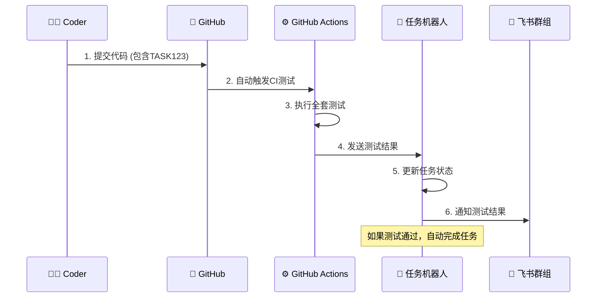

# 🤖 自动化测试流程完整指南

## 🎯 流程概述

当coder完成任务后，只需要**提交代码到GitHub**，系统就会自动执行完整的测试流程并反馈结果给任务管理机器人。



## 📋 详细流程步骤

### 步骤1: Coder提交代码
```bash
# Coder在本地完成开发后
git add .
git commit -m "TASK123: 实现用户登录功能

- 添加JWT认证
- 实现密码验证
- 添加用户会话管理"

git push origin main
```

### 步骤2: 自动触发测试 ⚡
一旦代码推送到GitHub，系统**立即自动执行**：

#### 🔍 代码质量检查
- **代码格式检查** (black, isort)
- **代码规范检查** (flake8)  
- **类型检查** (mypy)

#### 🧪 功能测试
- **单元测试** (pytest)
- **集成测试** (API测试)
- **覆盖率检查** (代码覆盖率)

#### 🔒 安全检查
- **依赖安全扫描** (safety)
- **代码安全检查** (bandit)

#### 🐳 部署验证
- **Docker构建测试**
- **容器运行验证**

### 步骤3: 智能结果分析 🧠
系统自动分析测试结果：

```python
# 测试结果评估逻辑
if all_tests_passed:
    status = "✅ 测试通过 - 自动完成任务"
    action = "complete_task"
else:
    status = "❌ 测试失败 - 需要修复"
    action = "request_fixes"
```

### 步骤4: 自动通知和状态更新 📲

#### 通知到飞书群组：
```
🎉 任务测试完成！

📋 任务：TASK123 - 用户登录功能
👨‍💻 开发者：张三
📊 测试结果：✅ 所有检查通过

详细结果：
✅ 代码质量：通过
✅ 单元测试：通过 (覆盖率95%)
✅ 集成测试：通过
✅ 安全检查：通过
✅ 构建测试：通过

🎊 任务已自动完成！
```

#### 如果测试失败：
```
❌ 任务测试失败

📋 任务：TASK123 - 用户登录功能  
👨‍💻 开发者：张三
📊 测试结果：需要修复

失败项目：
❌ 单元测试：2个测试用例失败
❌ 代码规范：发现5个格式问题
✅ 安全检查：通过
✅ 构建测试：通过

🔗 详细日志：https://github.com/repo/actions/runs/123456

请修复问题后重新提交。
```

## 🛠️ 配置要求

### 1. GitHub仓库配置

#### A. Secrets配置
在GitHub仓库的 Settings → Secrets 中添加：

```
TASK_WEBHOOK_URL=https://your-task-bot.com/webhook/github/
GITHUB_WEBHOOK_SECRET=your-secret-key
```

#### B. Webhook配置  
在GitHub仓库的 Settings → Webhooks 中添加：

- **URL**: `https://your-task-bot.com/webhook/github/`
- **事件**: Workflow runs, Check runs, Push, Pull requests
- **密钥**: 与GITHUB_WEBHOOK_SECRET相同

### 2. 任务机器人配置

确保任务系统的`config.yaml`包含：

```yaml
github:
  webhook_secret: "your-secret-key"
  access_token: "github-personal-access-token"

ci:
  auto_completion:
    enabled: true
    required_checks:
      - "quality_check"
      - "unit_tests" 
      - "build"
```

## 🎮 使用示例

### 场景1: 新功能开发

```bash
# 1. Coder接到任务：开发用户注册API
# 2. 创建分支开发
git checkout -b feature/user-registration

# 3. 完成开发
# ... 编写代码 ...

# 4. 提交代码（关键：包含任务ID）
git commit -m "TASK456: 实现用户注册API

功能特性：
- 邮箱验证注册
- 密码强度检查  
- 自动发送验证邮件
- 用户信息存储

测试覆盖：
- 单元测试覆盖率100%
- 集成测试通过
- 安全验证完成"

# 5. 推送代码
git push origin feature/user-registration

# 6. 系统自动开始测试！
```

**预期结果**：
- 5-10分钟后收到自动测试结果
- 如果通过，任务自动标记为完成
- 群组收到通知，HR可以验收

### 场景2: Bug修复

```bash
# 1. Coder收到bug报告任务
# 2. 修复代码
git commit -m "TASK789: 修复登录接口bug

问题描述：
- 密码验证逻辑错误
- 错误消息不明确

修复内容：
- 更正密码验证算法
- 优化错误提示信息
- 添加边界条件测试"

git push
```

**预期结果**：
- 自动回归测试确保bug被修复
- 确认没有引入新问题
- 自动完成修复任务

## 📊 测试标准和评估

### ✅ 自动通过标准
满足以下条件将自动完成任务：

1. **代码质量**: 无格式错误，符合规范
2. **功能测试**: 所有单元测试通过
3. **集成测试**: API测试通过
4. **安全检查**: 无安全漏洞
5. **构建测试**: Docker构建成功

### ❌ 需要修复的情况
以下情况将要求coder修复：

1. **测试失败**: 单元测试或集成测试不通过
2. **代码质量**: 格式不规范或逻辑复杂度过高
3. **安全问题**: 发现安全漏洞或依赖问题
4. **构建失败**: Docker构建或部署问题

### 🔄 修复流程
如果测试失败：

1. **收到通知**: 群组和私聊收到详细失败信息
2. **查看日志**: 点击链接查看具体错误详情
3. **本地修复**: 根据错误信息修复代码
4. **重新提交**: 修复后重新push，自动重新测试
5. **重复直到通过**: 最多允许3次修复机会

## 🚀 高级功能

### 1. 渐进式测试
```yaml
# 根据代码变更范围调整测试深度
small_change:  # < 50行代码
  - quick_tests_only
  
medium_change: # 50-200行代码  
  - full_unit_tests
  - integration_tests
  
large_change:  # > 200行代码
  - comprehensive_tests
  - performance_tests
  - security_audit
```

### 2. 智能测试优化
```python
# 只运行相关测试，提高效率
if changed_files_include('auth/'):
    run_auth_tests()
if changed_files_include('api/'):
    run_api_tests()
```

### 3. 并行测试加速
- 多个Python版本并行测试
- 不同测试套件并行执行
- 总测试时间控制在10分钟内

## 🎯 效果和价值

### 对Coder的价值
- ✅ **即时反馈**: 提交后立即知道代码质量
- ✅ **减少返工**: 提前发现问题，避免后期修复
- ✅ **提升技能**: 通过测试反馈改进编码习惯
- ✅ **专注开发**: 无需手动运行测试，专注功能实现

### 对项目的价值  
- ✅ **质量保证**: 每次提交都经过严格测试
- ✅ **快速交付**: 自动化验收，缩短交付周期
- ✅ **风险控制**: 提前发现潜在问题
- ✅ **持续改进**: 测试数据指导质量提升

### 对管理的价值
- ✅ **实时监控**: 随时了解任务进展和质量
- ✅ **客观评估**: 基于测试结果的客观评价
- ✅ **资源优化**: 减少人工验收工作量
- ✅ **数据驱动**: 基于测试数据做决策

## 📈 监控和分析

### 实时监控面板
- 当前运行的测试任务
- 测试通过率趋势
- 平均测试时间
- 常见失败原因

### 质量报告
- 每日/周/月测试统计
- Coder个人质量报告
- 项目质量健康度
- 改进建议和趋势分析

## 🎉 开始使用

### 快速启动清单
- [ ] ✅ GitHub Actions工作流已部署
- [ ] ✅ Webhook配置已完成
- [ ] ✅ 任务机器人已集成
- [ ] ⚙️ 配置Secrets和环境变量
- [ ] 🧪 进行首次测试提交
- [ ] 📊 验证通知和状态更新

### 下一步操作
1. **配置环境**: 按照上面的配置要求设置
2. **测试流程**: 创建一个测试任务验证整个流程
3. **培训团队**: 让coder了解新的工作流程
4. **监控优化**: 根据使用情况持续优化测试策略

---

**🎊 现在您的项目已具备完全自动化的测试和验收能力！Coder只需专注于编写代码，机器人会自动处理其余所有工作。** 